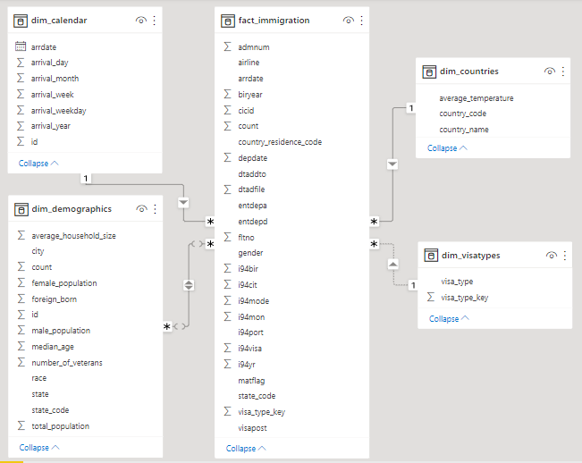
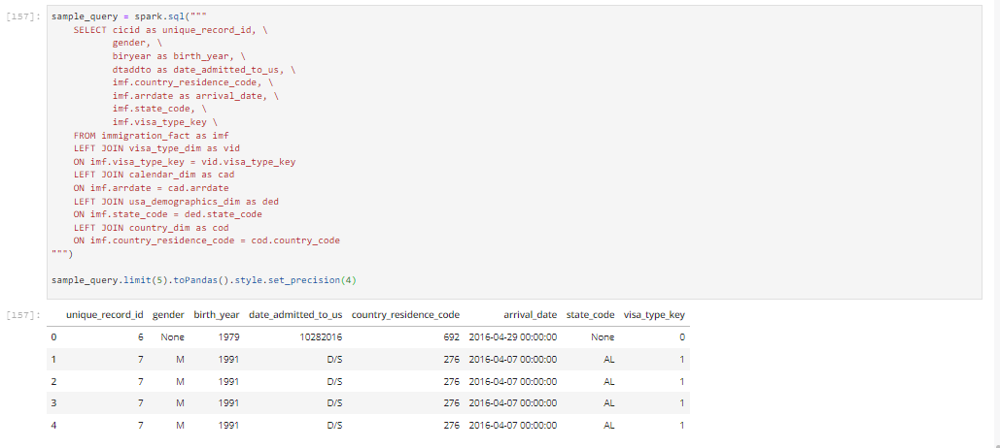

# Data Engineering Capstone Project

## Project Summary

The purpose of doing this project is to build a database that could be use to analyze questions related to immigration. For example, we would use this data model to find answer for questions like how many people immigrate to the US, where they came from, which climate did they lived ?
Data for this project came from I94 Label Description.

## Data and Code Script

This code folder use data on local machine, but you can still upload data in inputs folder to your Amazon S3 to run and save dimensional tables, fact table on Amazon S3. The file i94res.csv was added in order to create mapping dimensional tables.

In addition to the data files, the project workspace includes:
* folder [**inputs**](inputs) -> contains inputs raw data needed for Spark transformation on local machine.
* folder [**outputs**](outputs) -> contain outputs as dimentional tables and fact tables stored in parquets files.
* **etl.py** -> Defaul: Read files on local machine and transform to dimensional tables, fact table to store processed data in parquet files. You can change the input/output path to reads data from S3 buckets and save back to it.
* **etl_functions.py** -> functions for creating fact and dimension tables.
* **utility.py** -> functions for data visualizations in Jupyter Notebook file and cleaning raw data. 
* **quality_checks.py** -> functions for data quality check of dim / fact tables.
* **config.cfg** -> credentials to access AWS EMR.
* **Jupyter Notebooks** -> used for exploring data, testing, cleaning and building the ETL pipeline.

### The project follows the following steps:

* Step 1: Scope the Project and Gather Data
* Step 2: Explore and Assess the Data
* Step 3: Define the Data Model
* Step 4: Run ETL to Model the Data
* Step 5: Complete Project Write Up

### Technologies and tools used in this project:
- Python 3.9
- Pandas
- Seaborn
- Matplotlib
- Amazon S3
- Apache Spark
- Power BI (for schema modeling)

## Step 1: Scope the Project and Gather Data
### Project Scope

This project will use I94 immigration raw data, world temperature raw data and demographic raw data to create dim fact tables for analytical purposes.

- Data used for building:
    - > I94 immigration raw data `../../../data/18-83510-I94-Data-2016/i94_apr16_sub.sas7bdat`
    - > World temperature raw data `../../data2/GlobalLandTemperaturesByCity.csv`
    - > Demographic raw data `us-cities-demographics.csv`
- Coding:
    - > PySpark framework
    - > Pandas for data exploration and plot chart
    - > Amazon S3 for running on Amazon Web Service 

## Step 2: Explore and Assess the Data
> View detail in jupyter notebook file [Capstone_Project_ThucHH](Capstone_Project_ThucHH) and search keyword #Explore or #Assess.

## Step 3: Define the Data Model

### 3.1 Data Dictionary of datasets

I94 Immigration Data

<table class="tg" align="center">
  <tr>
    <th class="tg-0pky">Feature</th>
    <th class="tg-0pky">Description</th>
  </tr>
 <tr><td class="tg-0pky">cicid</td><td class="tg-0pky">Unique record ID</td>
 <tr><td class="tg-0pky">i94yr</td><td class="tg-0pky">4 digit year</td>
 <tr><td class="tg-0pky">i94mon</td><td class="tg-0pky">Numeric month</td>
 <tr><td class="tg-0pky">i94cit</td><td class="tg-0pky">3 digit code for immigrant country of birth</td>
 <tr><td class="tg-0pky">i94res</td><td class="tg-0pky">3 digit code for immigrant country of residence </td>
 <tr><td class="tg-0pky">i94port</td><td class="tg-0pky">Port of admission</td>
 <tr><td class="tg-0pky">arrdate</td><td class="tg-0pky">Arrival Date in the USA</td>
 <tr><td class="tg-0pky">i94mode</td><td class="tg-0pky">Mode of transportation (1 = Air; 2 = Sea; 3 = Land; 9 = Not reported)</td>
 <tr><td class="tg-0pky">i94addr</td><td class="tg-0pky">USA State of arrival</td>
 <tr><td class="tg-0pky">depdate</td><td class="tg-0pky">Departure Date from the USA</td>
 <tr><td class="tg-0pky">i94bir</td><td class="tg-0pky">Age of Respondent in Years</td>
 <tr><td class="tg-0pky">i94visa</td><td class="tg-0pky">Visa codes collapsed into three categories</td>
 <tr><td class="tg-0pky">count</td><td class="tg-0pky">Field used for summary statistics</td>
 <tr><td class="tg-0pky">dtadfile</td><td class="tg-0pky">Character Date Field - Date added to I-94 Files</td>
 <tr><td class="tg-0pky">visapost</td><td class="tg-0pky">Department of State where where Visa was issued </td>
 <tr><td class="tg-0pky">occup</td><td class="tg-0pky">Occupation that will be performed in U.S</td>
 <tr><td class="tg-0pky">entdepa</td><td class="tg-0pky">Arrival Flag - admitted or paroled into the U.S.</td>
 <tr><td class="tg-0pky">entdepd</td><td class="tg-0pky">Departure Flag - Departed, lost I-94 or is deceased</td>
 <tr><td class="tg-0pky">entdepu</td><td class="tg-0pky">Update Flag - Either apprehended, overstayed, adjusted to perm residence</td>
 <tr><td class="tg-0pky">matflag</td><td class="tg-0pky">Match flag - Match of arrival and departure records</td>
 <tr><td class="tg-0pky">biryear</td><td class="tg-0pky">4 digit year of birth</td>
 <tr><td class="tg-0pky">dtaddto</td><td class="tg-0pky">Character Date Field - Date to which admitted to U.S. (allowed to stay until)</td>
 <tr><td class="tg-0pky">gender</td><td class="tg-0pky">Non-immigrant sex</td>
 <tr><td class="tg-0pky">insnum</td><td class="tg-0pky">INS number</td>
 <tr><td class="tg-0pky">airline</td><td class="tg-0pky">Airline used to arrive in U.S.</td>
 <tr><td class="tg-0pky">admnum</td><td class="tg-0pky">Admission Number</td>
 <tr><td class="tg-0pky">fltno</td><td class="tg-0pky">Flight number of Airline used to arrive in U.S.</td>
 <tr><td class="tg-0pky">visatype</td><td class="tg-0pky">Class of admission legally admitting the non-immigrant to temporarily stay in U.S.</td>
</table>

World Temperature Data

<table class="tg" align="center">
  <tr>
    <th class="tg-0pky">Feature</th>
    <th class="tg-0pky">Description</th>
  </tr>
 <tr><td class="tg-0pky">dt</td><td class="tg-0pky">Date</td>
 <tr><td class="tg-0pky">AverageTemperature</td><td class="tg-0pky">Global average land temperature in celsius</td>
 <tr><td class="tg-0pky">AverageTemperatureUncertainty</td><td class="tg-0pky">95% confidence interval around the average</td>
 <tr><td class="tg-0pky">City</td><td class="tg-0pky">Name of City</td>
 <tr><td class="tg-0pky">Country</td><td class="tg-0pky">Name of Country</td>
 <tr><td class="tg-0pky">Latitude</td><td class="tg-0pky">City Latitude</td>
 <tr><td class="tg-0pky">Longitude</td><td class="tg-0pky">City Longitude</td>
</table>

U.S. City Demographic Data

<table class="tg" align="center">
  <tr>
    <th class="tg-0pky">Feature</th>
    <th class="tg-0pky">Description</th>
  </tr>
 <tr><td class="tg-0pky">City</td><td class="tg-0pky">City Name</td>
 <tr><td class="tg-0pky">State</td><td class="tg-0pky">US State where city is located</td>
 <tr><td class="tg-0pky">Median Age</td><td class="tg-0pky">Median age of the population</td>
 <tr><td class="tg-0pky">Male Population</td><td class="tg-0pky">Count of male population</td>
 <tr><td class="tg-0pky">Female Population</td><td class="tg-0pky">Count of female population</td>
 <tr><td class="tg-0pky">Total Population</td><td class="tg-0pky">Count of total population</td>
 <tr><td class="tg-0pky">Number of Veterans</td><td class="tg-0pky">Count of total Veterans</td>
 <tr><td class="tg-0pky">Foreign born</td><td class="tg-0pky">Count of residents of the city that were not born in the city</td>
 <tr><td class="tg-0pky">Average Household Size</td><td class="tg-0pky">Average city household size</td>
 <tr><td class="tg-0pky">State Code</td><td class="tg-0pky">Code of the US state</td>
 <tr><td class="tg-0pky">Race</td><td class="tg-0pky">Respondent race</td>
 <tr><td class="tg-0pky">Count</td><td class="tg-0pky">Count of city's individual per race</td>
</table>

### 3.2 Data model

- **fact_immigration**:  created from raw data I94 lablel description `I94_SAS_Labels_Descriptions.SAS`
- **dim_calendar**: Derived from I94 dataset
- **dim_visatypes**: Derived from I94 dataset
- **dim_countries**: Mapped I94 dataset with `i94res.csv` and temperature dataset `../../data2/GlobalLandTemperaturesByCity.csv`.
- **dim_demographics**: created from `us-cities-demographics.csv`

### 3.3 Mapping Out Data Pipelines
Data pipeline processing steps:
- 1. Load the raw data `I94_SAS_Labels_Descriptions.SAS` from `inputs` folder -> `immigration_dataset`
- 2. Clean `immigration_dataset` -> dropna and duplicated rows
- 3. Derive `immigration_dataset` -> `dim_visatypies`, `dim_calendar` and `temperature_dataset`
- 4. Load and clean `i94res.csv` -> `i94res_mapping_dataset`
- 5. Map `i94res_mapping_dataset` with `temperature_dataset` and `immigration_dataset` -> `dim_countries`
- 6. Load and clean `us-cities-demographics.csv` -> `dim_demographics`
- 7. Create `fact_immigration`
- 8. Return dim fact tables for `data quality checks`
- 9. Run data quality check for schema completeness, column nulls, column name matching.

## Step 4: Run Pipelines to Model the Data 

To build data warehouse on local machine: 
- Command line: `python etl.py`

To build data warehouse with data on Amazon S3:
- Upload files in [inputs folder](inputs) to your S3 bucket
- Add your credentials to [config file](config.cfg)
- Change the input_data, output_data path at the end of file [etl.py](etl.py)
- Spark command line: `spark-submit --packages saurfang:spark-sas7bdat:2.0.0-s_2.10 etl.py`

## Step 5: Complete Project Write Up
* Clearly state the rationale for the choice of tools and technologies for the project.
    > Apache Spark is used in this project due to the ability to handle large amount of data, read multiple file formats, and APIs of Spark is easy to use and apply on this project.
    > Seaborn and matplotlib is used in this project to visualize the missing data and help user decide a solution to handle the problem.
* Propose how often the data should be updated and why.
    > The data pipeline will be update monthly due to large amount of data.
* Write a description of how you would approach the problem differently under the following scenarios:
 * IF The data was increased by 100x 
     > Spark still easily handle these large amount of data, user just need to increase cluster nodes in the Amazon EMR for smooth ETL process.
 * The data populates a dashboard that must be updated on a daily basis by 7am every day 
     > We need to use Apache Airflow to schedule the pipeline to run 7am daily. 
 * The database needed to be accessed by 100+ people.
     > We will move dim fact tables (stored in parquet format) on local machine or on Amazone S3 to the Amazon Redshift data warehouse to create credentials for 100+ user access.
 
* Sample query on the database
    